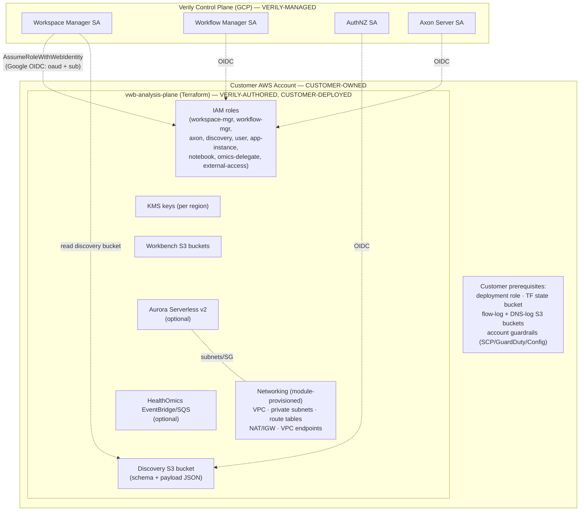
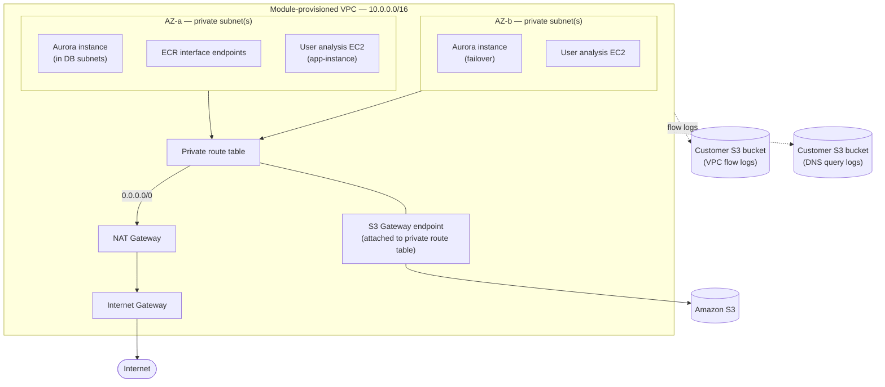
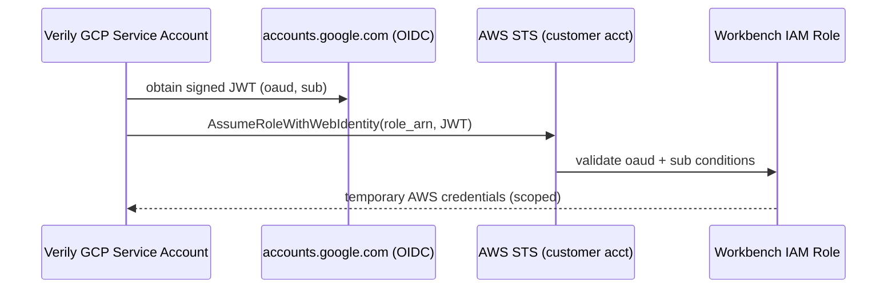

# Workbench BYOA Reference Architecture

**Audience:** Cloud/platform engineers ("Cloud Experts") deploying the Verily Workbench Analysis Plane into a **customer-owned AWS account**. Also intended as a blueprint for sales demonstrations and pre-sales architecture reviews.

**Scope:** This document describes the reference architecture for the `vwb-analysis-plane` Terraform module, the boundary between **customer-managed** and **Verily-managed** components, the infrastructure a customer must provide, and the process for validating compatibility before deployment.

## 1\. Deployment Model -- BYOA

The Analysis Plane follows a **Bring Your Own Account (BYOA)** model: the customer supplies a dedicated AWS account (plus a small set of prerequisites), and Verily's Terraform module provisions the **complete analysis plane inside that account** -- including the VPC, subnets, routing, NAT/IGW, KMS keys, IAM roles, workbench storage, optional data services (Aurora), and the discovery integration. The Verily control plane (running in GCP) then integrates over a single, read-only discovery handshake ([§7](#7-control-plane-integration-discovery)).

**What this means for a Cloud Expert:**

- The customer owns the **AWS account boundary**, account-level guardrails, the Terraform deployment role, and the Terraform state backend.
- Verily owns the **module** (all infrastructure inside the account) and the **GCP control plane**.
- The customer does **not** pre-build the VPC, subnets, KMS, IAM, or data services -- the module creates them. The customer supplies only the account and the handful of prerequisites in [§5](#5-infrastructure-requirements-what-customers-must-provide).

This model suits customers who require the workbench to run in their own AWS account and under their own billing, org policies, and audit controls, while delegating the internal architecture to a Verily-maintained, opinionated module.

--------------------------------------------------------------------------------

## 2\. Reference Architecture Diagram

### 2.1 High-level trust and ownership boundaries



### 2.2 Per-region network placement (single workbench region)

Provisioned by the module inside the customer account:



> **VERILY-MANAGED** (region-agnostic, in-account): KMS keys, Workbench S3 buckets, IAM roles, Discovery bucket, HealthOmics EventBridge bus + SQS (single global instance). **CUSTOMER-PROVIDED:** the AWS account, the flow-log/DNS-log S3 buckets, account guardrails.

--------------------------------------------------------------------------------

## 3\. Responsibility Matrix -- Customer vs. Verily

Layer                    | Component                                                                                       | Owner
------------------------ | ----------------------------------------------------------------------------------------------- | -------------------------------------------------
**Account & access**     | Dedicated AWS account                                                                           | **Customer**
                         | Terraform deployment IAM role                                                                   | **Customer**
                         | Terraform remote-state S3 bucket                                                                | **Customer**
                         | Account guardrails (SCPs, GuardDuty, Config, CloudTrail)                                        | **Customer**
**Configuration inputs** | Region selection (≥2, `primary_region` included)                                                | **Customer**
                         | Org inputs (`tenant`, `environment`, `account_name`, `deployment_id`, `semver_version`, `tags`) | **Customer**
                         | Feature flags (`aurora_serverless`, `omics`, `notebook`, endpoints)                             | **Customer**
**Networking**           | VPC, subnets, route tables, NAT, IGW                                                            | Verily module (in customer account)
                         | S3 gateway / ECR interface endpoints                                                            | Verily module (optional)
                         | Flow-log & DNS-log S3 buckets                                                                   | **Customer** (optional, pre-existing, referenced)
**Security**             | KMS keys (data + discovery)                                                                     | Verily module
                         | IAM roles & policies                                                                            | Verily module
**Data**                 | Workbench S3 buckets                                                                            | Verily module
                         | Aurora Serverless (Workspace Manager DB)                                                        | Verily module
**Compute**              | User analysis EC2 / SageMaker lifecycle configs                                                 | Verily module (IAM + config)
**Integration**          | Discovery bucket + role                                                                         | Verily module
                         | Control plane (GCP services)                                                                    | **Verily**
**Identity**             | GCP service accounts (control plane)                                                            | **Verily**

**Key principle:** Verily authors the module and operates the GCP control plane. The customer owns the AWS account and the Terraform execution. The two planes meet at exactly one handshake -- the **discovery bucket + discovery role** (see [§7](#7-control-plane-integration-discovery)).

--------------------------------------------------------------------------------

## 4\. Network Architecture

The module provisions the networking substrate per workbench region. This section documents that design so Cloud Experts understand what lands in the account and how the workload layer depends on it.

### 4.1 What the module builds (per region, `modules/vpc/`)

Element              | Design
-------------------- | -------------------------------------------------------------------------------------------------------------------------------------------------
**VPC**              | `10.0.0.0/16`, `enable_dns_hostnames = true`, `enable_dns_support = true`
**Private subnets**  | **2 per AZ**; AZ count = all AZs in region (`max`) or 2–4\. AZ0 subnets are large (`/24` + `/18`); other AZs `/26` + `/20` (asymmetric layout)
**Public subnet**    | Single subnet in AZ0, `10.0.2.0/24`
**Internet Gateway** | One, VPC-attached
**NAT Gateway**      | **One regional NAT** (`availability_mode = "regional"`, AWS-managed IPs/HA)
**Route tables**     | One public RT (`0.0.0.0/0` → IGW, public subnet only); one private RT (`0.0.0.0/0` → NAT, **all** private subnets)
**VPC endpoints**    | _Optional:_ S3 gateway (on private RT); ECR `api`+`dkr` interface endpoints (in AZ0 subnet, `private_dns_enabled`)
**Flow logs**        | _Optional:_ `aws_flow_log` → **customer** S3 bucket, `traffic_type = ALL`, 600s aggregation. Created only when a flow-log bucket name is supplied
**DNS query logs**   | _Optional_ Route 53 resolver query logging → customer S3 bucket

> Design notes: a single regional NAT carries all private egress; there is a single public subnet in AZ0; one shared private route table serves all private subnets; the ECR interface-endpoint security group allows ingress `TCP 443` from the whole VPC CIDR and defines **no egress rule** (default-deny egress).

### 4.2 Subnet roles consumed by workloads

Consumer                    | Uses                                       | Notes
--------------------------- | ------------------------------------------ | -----------------------------------------------------------------------------------------------------------------------------------------------
**Aurora**                  | VPC ID + private subnet CIDRs              | Creates its **own DB subnets** at `10.0.188.0/23` and `10.0.190.0/23` (`modules/aurora/locals.tf`); SG ingress `5432` from private subnet CIDRs
**S3 gateway endpoint**     | Private route table ID                     | Attaches endpoint to the RT
**ECR interface endpoints** | VPC ID + VPC CIDR + one AZ0 private subnet | Interface endpoints for `ecr.api` / `ecr.dkr`
**User analysis EC2**       | Private subnets                            | Launched by Workspace Manager at runtime, egress via NAT

### 4.3 Egress and connectivity requirements

Workloads and the control-plane integration require **outbound connectivity** to:

- **Amazon S3** (workbench buckets, discovery bucket) -- via the S3 gateway endpoint (recommended, free) or NAT.
- **Amazon ECR** (container image pulls) -- via the ECR interface endpoints (recommended) or NAT.
- **Google OIDC / Verily control plane** -- the control plane calls **into** AWS STS/S3 public endpoints; **no inbound path into the VPC is required**. Workloads calling Verily APIs need outbound HTTPS.
- **AWS service APIs** (STS, RDS, KMS, CloudWatch, SSM, SageMaker, Secrets Manager) -- via NAT.

> The module's default networking is internet-egress via NAT. A fully private (no-NAT) posture is not a first-class option today -- it would require adding interface endpoints for STS, KMS, CloudWatch Logs, SSM, EC2 Messages, SageMaker, RDS, and Secrets Manager, since the module only optionally creates S3 + ECR endpoints.

--------------------------------------------------------------------------------

## 5\. Infrastructure Requirements (What Customers Must Provide)

Under BYOA the customer provides the account and a small set of prerequisites; the module provisions everything else.

### 5.1 AWS account & access

- A dedicated AWS account (or well-isolated OU member) for the workbench environment.
- A **Terraform deployment IAM role** with permissions to create VPC/networking, IAM roles & policies, KMS keys, S3, RDS Aurora, SageMaker lifecycle configs, EventBridge/SQS, and CloudWatch. Administrator-equivalent is simplest for initial deployments; scope down for production (see [DEPLOYMENT.md](DEPLOYMENT.md#example-iam-role-configuration)).
- An **S3 bucket for Terraform remote state** (versioned, encrypted) and a matching backend config.

### 5.2 Logging prerequisites (optional)

- A **flow-log S3 bucket** with the `delivery.logs.amazonaws.com` bucket policy -- _optional but recommended._ Supply `vpc_flow_log_bucket_name` to enable VPC flow logs; omit it to skip them. See [§8.3](#83-flow-log-bucket-policy).
- A **DNS-log S3 bucket** for Route 53 resolver query logs -- _optional._

### 5.3 Regions

Workbench currently supports these regions; select **≥2**, and ensure `primary_region` is among them: `us-east-1`, `us-west-1`, `us-west-2`, `eu-west-2`.

### 5.4 Organizational inputs

- `tenant` (≤5 chars), `environment` (`dev`/`test`/`stage`/`prod`), `account_name`, `deployment_id` (3–5 chars), `semver_version` (`vX.Y.Z`).
- Tagging conventions to merge via `var.tags` (the module stamps its own ABAC tags -- see [§6.4](#64-abac-tag-model)).

### 5.5 Account guardrails (customer-owned)

- SCPs, GuardDuty, AWS Config, CloudTrail, and any org-level controls the account is subject to.
- Confirm none of the customer's guardrails block the resources the module creates (KMS key creation, IAM role creation with federation trust, RDS, NAT gateways).

### 5.6 What the customer does **not** provide

The VPC/networking, KMS keys, workbench S3 buckets, all IAM roles/policies, Aurora, the discovery bucket, and the HealthOmics integration are **created by the module**.

--------------------------------------------------------------------------------

## 6\. Security Boundaries & IAM Requirements

### 6.1 The core trust boundary -- GCP → AWS via OIDC web identity

The Verily control plane runs as **Google Cloud service accounts** and reaches into the customer AWS account using **`sts:AssumeRoleWithWebIdentity`** against Google's OIDC provider (`accounts.google.com`). No long-lived AWS credentials are shared with Verily. Each federated role's trust policy is gated on two JWT claims:

- **`oaud`** (audience) -- an environment-specific value (e.g. `aws_workbench_prod`).
- **`sub`** (subject) -- the specific Verily GCP service account ID.

Four control-plane service accounts are trusted, wired from `var.gcp_oauth_accounts[environment]`: `workspace_manager`, `workflow_manager`, `authnz`, `axon_server`.



### 6.2 IAM roles created by the module

Role                    | Assumed by                                  | Purpose / scope
----------------------- | ------------------------------------------- | --------------------------------------------------------------------------------------------------------------
**Workspace Manager**   | Verily WSM SA (OIDC)                        | Primary orchestration role: EC2, SageMaker, VPC Reachability Analyzer, KMS-manager, S3-manager, Aurora-manager
**Workbench User**      | Workspace Manager (role chain + TagSession) | Per-user, ABAC-tag-scoped access to S3/EC2/Aurora/KMS/SSM
**Workflow Manager**    | Verily WFM SA (OIDC)                        | HealthOmics orchestration; **no** Omics perms directly -- must assume the Omics delegate
**Axon Server**         | Verily Axon SA (OIDC)                       | Read-only CloudWatch Logs + EC2 read
**Discovery**           | All 4 Verily SAs (OIDC)                     | Read-only discovery bucket + `kms:Decrypt` + `iam:GetRole` on app-instance role
**App Instance**        | `ec2.amazonaws.com`                         | Instance profile for user analysis VMs: logs + SSM + self-scoped EC2
**Notebook**            | `sagemaker.amazonaws.com`                   | SageMaker notebook execution: logs + list tags
**Omics User Delegate** | Workflow Manager (chain)                    | Holds the actual HealthOmics permissions, scoped by session tags (privilege separation)
**Omics Bus Invoker**   | `events.amazonaws.com`                      | EventBridge → SQS forwarding
**External Access**     | Workspace Manager (chain)                   | ABAC role for **cross-account** S3/ECR reach; explicitly **denies** local-account buckets

### 6.3 KMS & encryption boundaries

- **Per-region data key** (`alias/vwb-<id>-workspace-manager`, rotation on) encrypts workbench S3 buckets and EC2/EBS volumes. Access is granted via IAM identity policies scoped by **KMS alias condition** and **S3 encryption context** (not by key ARN, since ARNs are generated at apply time).
- **Discovery key** encrypts the discovery bucket (SSE-KMS, SSE-C blocked).
- Aurora uses AWS-managed RDS encryption with the master password in Secrets Manager (RDS-managed secret).

### 6.4 ABAC tag model

Access is enforced by **attribute-based access control**: policies compare `aws:PrincipalTag/<key>` (session tags carried by the assumed role) against `aws:ResourceTag/<key>` (tags stamped on resources). A session can only touch resources whose tags match. Examples: users can only SSM into instances tagged with their `UserID`; Omics operations are scoped to the caller's `WorkspaceId`; external S3/ECR reach is derived entirely from `ExternalBucket*` / `ExternalRepository*` principal tags. All policy Statement IDs are prefixed `Vwb` for identifiability.

### 6.5 Additional guardrails

- **Privilege separation:** Workflow Manager cannot touch HealthOmics without assuming the Omics delegate role.
- **Permission boundary** on Omics execution roles confines them to workbench-prefixed buckets and hard-denies destructive S3 actions and access to protected buckets.
- **External-access deny-local:** the external-access role explicitly denies any bucket/repo in the local account, so it can _only_ reach other accounts.
- **No inbound to VPC required** for the control-plane integration -- the trust flows GCP→AWS public STS/S3 endpoints.

### 6.6 Customer security responsibilities

- Account-level guardrails: SCPs, GuardDuty, AWS Config, CloudTrail.
- The Terraform deployment role and state bucket security.
- Reviewing and approving the trusted `gcp_oauth_accounts` for the target environment.
- Any additional network controls layered on the module-provisioned VPC (e.g. NACLs, egress filtering) that the customer's policies require.

--------------------------------------------------------------------------------

## 7\. Control Plane Integration (Discovery)

The Analysis Plane and the Verily control plane meet at a **single, pull-based S3 handshake**. The module never calls Verily; instead it publishes a description of everything it deployed, and grants Verily a read-only cross-cloud role.

### 7.1 Mechanism

- The module writes **versioned JSON objects** to a dedicated **discovery S3 bucket** (`vwb-<deployment_id>-<account_id>-discovery`), KMS-encrypted, public access fully blocked.
- Each object contains a base64-encoded **Avro schema** + matching **payload**: `{ "schema": base64(avsc), "payload": base64(payload) }`.
- Object keys are versioned by workbench major version:

  - Global: `<major_version>/environment/config.json`
  - Per region: `<major_version>/landingzones/<region>/config.json`

### 7.2 What is published

Schema                                  | Scope            | Contents
--------------------------------------- | ---------------- | ------------------------------------------------------------------------------------------------------------------------------------------------------------------------------------------------------------------------
`Environment.avsc` (`EnvironmentModel`) | Global / account | Account metadata + **all IAM role ARNs** the control plane must assume (app-instance, axon, external-access, notebook, user, workspace-manager, workflow-manager, omics-delegate), Omics boundary policy ARN + queue URL
`LandingZone.avsc` (`LandingZoneModel`) | Per region       | VPC ID, private subnet IDs + per-AZ map, workbench bucket ARN/ID, KMS key ARN/ID, SageMaker notebook lifecycle config ARNs, and optional `aurora_clusters` map

### 7.3 The handshake (customer action)

After `terraform apply`, two outputs are produced:

- **`discovery_role_arn`** -- the cross-cloud role the control plane assumes.
- **`discovery_bucket_name`** -- where the config lives.

The customer provides these two values to Verily during workbench environment registration. Verily's GCP service accounts then `AssumeRoleWithWebIdentity` → `ListBucket`/`GetObject` → base64-decode and Avro-validate → learn every role, bucket, key, VPC/subnet, and optional Aurora/Omics resource needed to operate the deployment. `discovery_role_arn` is _how to authenticate_; `discovery_bucket_name` is _where to read_. That is the entire integration surface.

--------------------------------------------------------------------------------

## 8\. Customer-Facing Compatibility Validation

A repeatable pre-deployment process so customers can confirm their account is ready.

### 8.1 Phase 1 -- Prerequisites checklist

Confirm all items in [§5](#5-infrastructure-requirements-what-customers-must-provide): dedicated account, deployment role, Terraform state bucket, regions (≥2, primary included), org inputs, and -- if flow logs are enabled -- the flow-log bucket with the log-delivery policy.

```bash
# Confirm identity / target account
aws sts get-caller-identity

# If enabling flow logs: confirm the bucket exists and carries the log-delivery policy
aws s3api get-bucket-policy --bucket <flow-log-bucket-name>
```

### 8.2 Phase 2 -- Guardrail compatibility

Confirm account guardrails (SCPs, permission boundaries on the deployment role, Config rules) do not block the resources the module creates -- in particular: KMS key creation, IAM role creation with **web-identity federation trust** (`accounts.google.com`), NAT gateways, and RDS Aurora. If any SCP denies these, resolve before applying.

### 8.3 Phase 3 -- Terraform dry run

```bash
terraform init
terraform validate
terraform plan -out=tfplan          # review; expect ~100–200 resources
```

Review checklist:

- ✅ Correct AWS account ID and regions.
- ✅ If flow logs are enabled, the flow-log bucket exists and is referenced correctly.
- ✅ Trusted `gcp_oauth_accounts` match the intended environment.
- ✅ Feature flags reflect the intended footprint and cost.

### 8.4 Phase 4 -- Post-deploy control-plane handshake

1. Capture outputs: `terraform output discovery_role_arn discovery_bucket_name`.
2. Verify the discovery objects exist:

  ```bash
  aws s3 ls s3://<discovery_bucket_name>/<major_version>/environment/
  aws s3 ls s3://<discovery_bucket_name>/<major_version>/landingzones/<region>/
  ```

3. Provide `discovery_role_arn` + `discovery_bucket_name` to Verily for environment registration.

4. Verily confirms it can assume the role and read/validate the payload.

### 8.5 Validation summary table

Check                        | Tool                      | Pass criterion
---------------------------- | ------------------------- | --------------------------------------
Target account               | `sts get-caller-identity` | correct account/role
Flow-log bucket (if enabled) | `s3api get-bucket-policy` | log-delivery statements present
Guardrail compatibility      | account SCP/Config review | no deny on KMS/IAM-federation/NAT/RDS
Terraform plan               | `terraform plan`          | no errors; expected resource count
Discovery objects            | `s3 ls`                   | env + per-region `config.json` present
Control-plane assume         | Verily                    | role assumable, payload valid

--------------------------------------------------------------------------------

## 9\. Appendix -- Resource & Feature Inventory

### 9.1 Always-created (not feature-gated)

VPC · KMS keys (per region) · Workbench S3 buckets (per region) · SageMaker notebook lifecycle configs · Discovery bucket + role · and all IAM roles: workspace-manager, workbench-user, workflow-manager, axon-server, app-instance, notebook, ec2 policies, kms policies.

### 9.2 Feature-gated (`var.features.<key>`)

Feature key         | Creates                                                  | Networking dep                         | KMS dep
------------------- | -------------------------------------------------------- | -------------------------------------- | ----------------------
`aurora_serverless` | Aurora PostgreSQL Serverless v2 + SG + DB subnets        | VPC + private CIDRs; carves DB subnets | RDS-managed
`omics`             | HealthOmics EventBridge bus + SQS + rules + delegate IAM | None                                   | None (SQS unencrypted)
`notebook`          | Notebook execution IAM role                              | None                                   | None
`s3_endpoints`      | S3 gateway endpoint                                      | Private route table                    | None
`ecr_endpoints`     | ECR `api`+`dkr` interface endpoints + SG                 | VPC + AZ0 subnet                       | None

Config pattern for every regional feature: `{ enabled = bool, excluded_regions = [ ... ] }`. A disabled feature or an excluded region produces zero resources for that region.

### 10.3 Per-region deployment model

Regional resources use `for_each` over `workbench_regions`; account-global singletons (Omics bus/SQS, IAM policy modules) are created once. Default regions: `us-east-1`, `us-west-1`, `us-west-2`, `eu-west-2`.

--------------------------------------------------------------------------------

_This document reflects the `vwb-analysis-plane` module as explored on 2026-07-29\. For step-by-step deployment instructions, see

<deployment.md>.</deployment.md>

_
